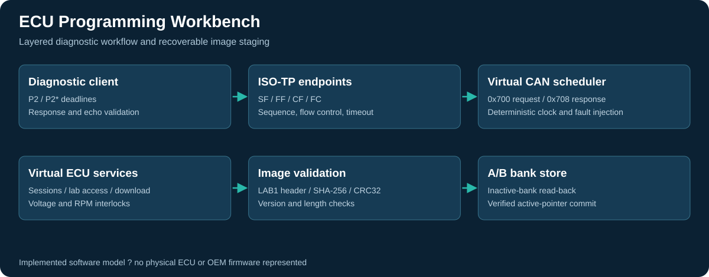

# ECU Programming Workbench

An executable diagnostic-programming laboratory: a client, CAN/ISO-TP transport model, stateful virtual ECU, and A/B image store. The project exercises interrupted programming, diagnostic state preservation and post-reset image verification.

**Platform:** owned virtual ECU; Python 3.10+, standard library. **Validation:** host simulation. This is independently authored with AI assistance for this review, not a previous commercial deployment, Bosch emulator or hardware flashing result.



## Quick start

```powershell
python verify.py
python -m workbench demo --output evidence
```

`verify.py` runs automated tests and an update with a deliberately lost TransferData acknowledgement. The demo uses a temporary bank directory and writes reports under `evidence/`. Existing named evidence files are regenerated. There is no real-CAN or ECU flashing adapter.

## Implemented engineering

| Layer | Implementation |
|---|---|
| Transport | Classical CAN frames; SF/FF/CF/FC; sequence rollover; flow-control block sizes and separation; WAIT limits; timeouts |
| Diagnostic client | Service and echo validation; bounded response-pending handling; P2/P2* timing; one-block retry after missing transfer acknowledgement |
| Virtual ECU | Session state; lab challenge/response; request/download/transfer/exit; routine control; reset; identification; DTC reporting |
| Programming policy | Engine stopped and supply-voltage window; bounded address and image length; monotonically increasing image version |
| Integrity | Image header, payload SHA-256 and image CRC32; read-back before activation; post-reset version and digest |
| Recovery | Inactive bank staging; atomic file replacement for the active pointer; deterministic interruption tests at three commit boundaries |

The lab security exchange uses a **public demonstration key** and a project-defined HMAC calculation. It does not recover or bypass any manufacturer's security algorithm. SHA-256 and CRC32 checks here are integrity checks, not signed secure boot.

## Source tour

| File | Responsibility |
|---|---|
| `workbench/isotp.py` | Bounded transport state machines and injected clock |
| `workbench/bus.py` | Deterministic frame scheduler and fault injection |
| `workbench/ecu.py` | Diagnostic services, sessions and programming interlocks |
| `workbench/client.py` | Tester workflow and response validation |
| `workbench/image.py` | Owned LAB1 image format |
| `workbench/storage.py` | Verified A/B staging and active-pointer commit |
| `tests/` | Transport, diagnostic and storage fault tests |

## Evidence

- `evidence/tests.txt`: actual local test output.
- `evidence/programming_report.json`: image identity, transfer retry, pending response and DTC comparison.
- `evidence/can_trace.json`: actual simulated CAN frames, timestamps and injected drops.
- `evidence/uds_trace.json`: reconstructed requests and responses from the same run.
- `evidence/candidate.lab` and `evidence/active.lab`: compare byte-for-byte after the update.
- `docs/PROTOCOL.md`: exact supported wire profile and memory/image formats.
- `docs/VALIDATION.md`: requirements, fault matrix and remaining release work.

## Boundaries

The A/B design is a filesystem model. It does not prove atomicity or electrical power-fail behavior on MCU flash. DTC preservation is verified for a synthetic pre-existing diagnostic record; no OEM torque strategy is present in this project. Security delay is process-local, so restart-resistant lockout is not implemented. ISO-TP support is an explicit subset, not a conformance certification.

For a physical bench implementation, replace the virtual transport with a validated controller adapter, define the authorized ECU protocol, and qualify flash geometry, erase/program failures, voltage sensing, watchdog behavior and power interruption. Do not substitute guessed Bosch addresses or seed/key logic into this lab.

Technical references: [Linux ISO-TP documentation](https://kernel.org/doc/html/latest/networking/iso15765-2.html) for transport concepts; [udsoncan client documentation](https://udsoncan.readthedocs.io/en/latest/udsoncan/client.html) for diagnostic service workflow. The implementation is original and does not depend on those libraries.

## Ownership and permissions

Copyright (c) 2026 **Abdullah Shabbir**. All rights reserved.

Public availability is for inspection and does not grant permission to reuse, run, modify, distribute or deploy the original materials. Written permission is required, subject to applicable law and GitHub's public-repository terms. See [LICENSE](LICENSE). Build and test instructions are for the owner and authorized users.

## Continuous integration template

`ci/github-actions.yml` contains the GitHub Actions configuration. It is provided as a template and is not enabled in this repository. To enable it, an authorized maintainer with GitHub workflow-write permission can place it at `.github/workflows/ci.yml`. Local validation results are included under `evidence/`.
